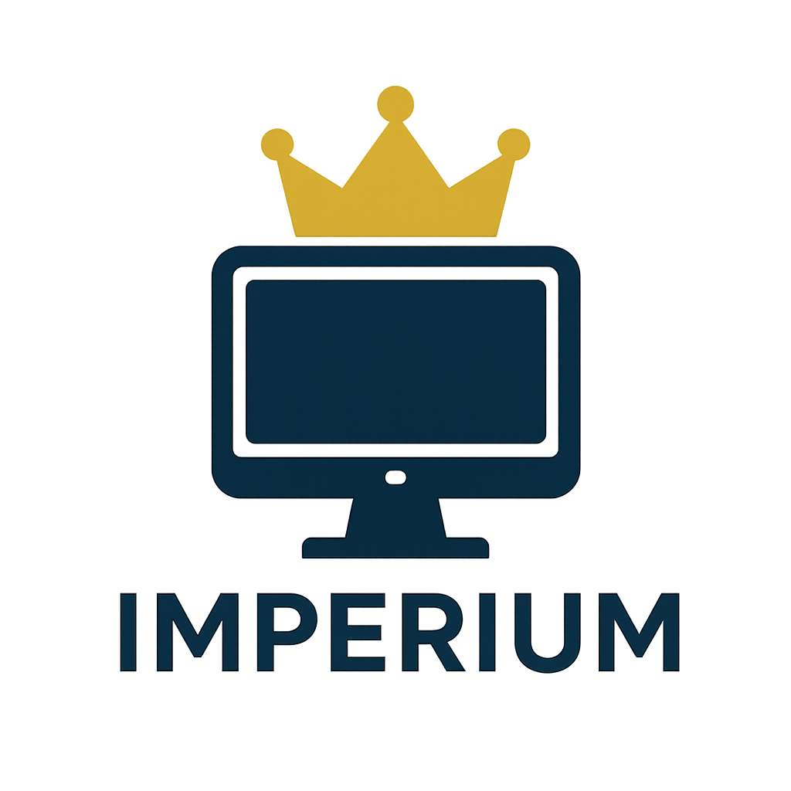
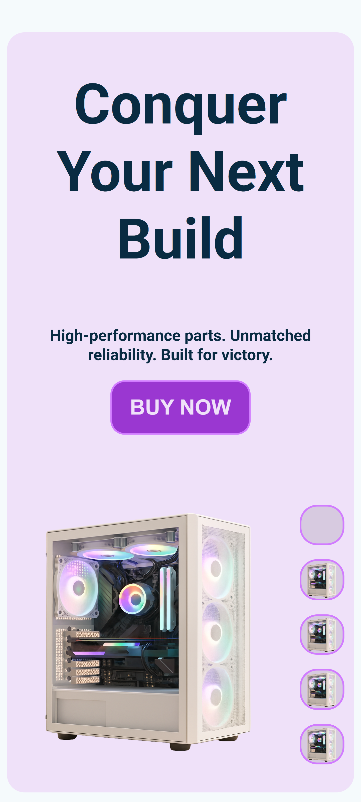
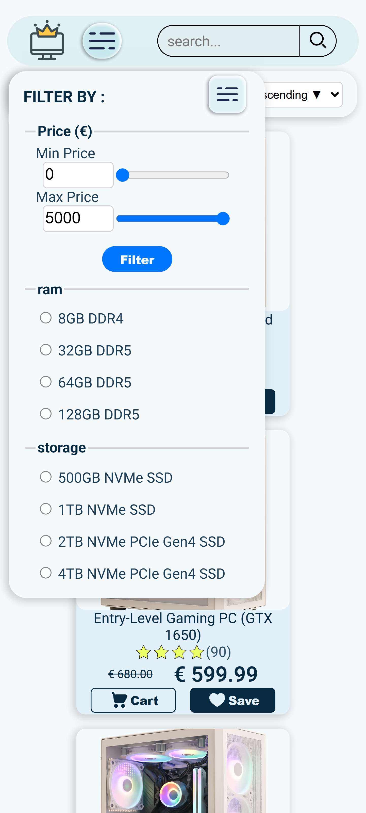
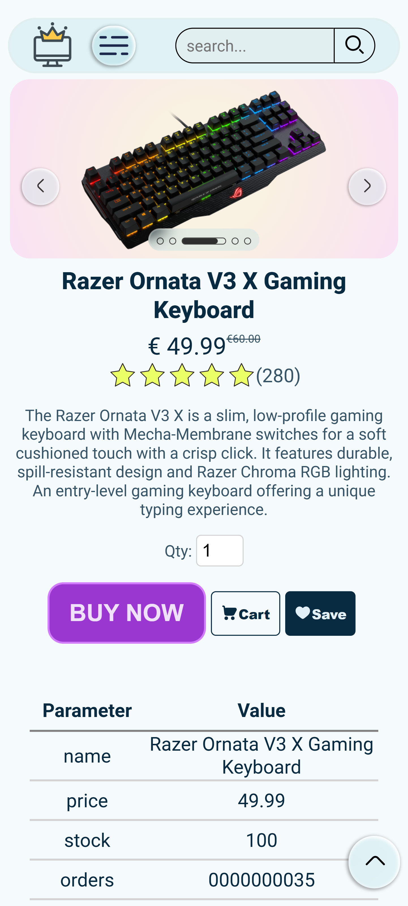

  

#🛒 Imperium

**Imperium** is a full-stack e-commerce Single Page Application (SPA) built using **JavaScript**, **HTML**, **CSS**, and **PHP**. Developed as a university project, it delivers a modern and dynamic shopping experience with a custom routing system, secure login via Google, and integrated Stripe payments.

---
## 📽️ Project Preview

  

[Full Demo Video Here](https://youtu.be/-MIUjzko_6A)
## 📸 Screenshots (mobile)

  
  
  

---

## 🧩 Features

- ✅ **Single Page Application** with custom client-side routing
- ✅ Fully **responsive design** for all screen sizes
- ✅ **Google OAuth** login integration
- ✅ **Stripe payment** processing
- ✅ **Dynamic product filtering**
- ✅ **Shopping cart** and **saved items** system
- ✅ **Order history**
- ✅ Built using **vanilla technologies** (HTML/CSS/JS/PHP)

---

## 🧠 My Role

As the **Front-End Developer** of Imperium, I was responsible for:

- 🎨 Designing and implementing the **Landing Page**
- 🛍️ Creating the **Products Page** with **filtering functionality**
- 📄 Developing the **Single Product View Page**
- 🔀 Implementing a **Custom Routing System**
- 🔐 Designing and integrating the **Login Page** with **Google Login**
- 💳 Integrating **Stripe Checkout** for secure payments
- 📱 Ensuring full **responsiveness and interactivity**

---
